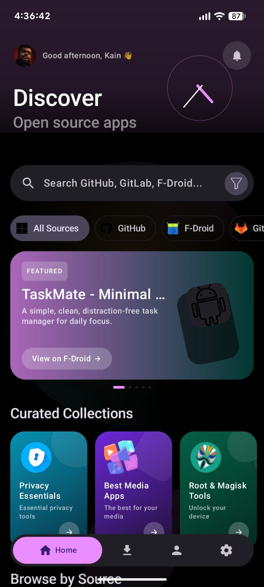
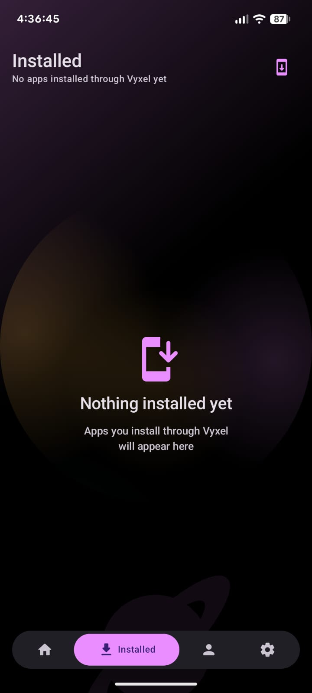
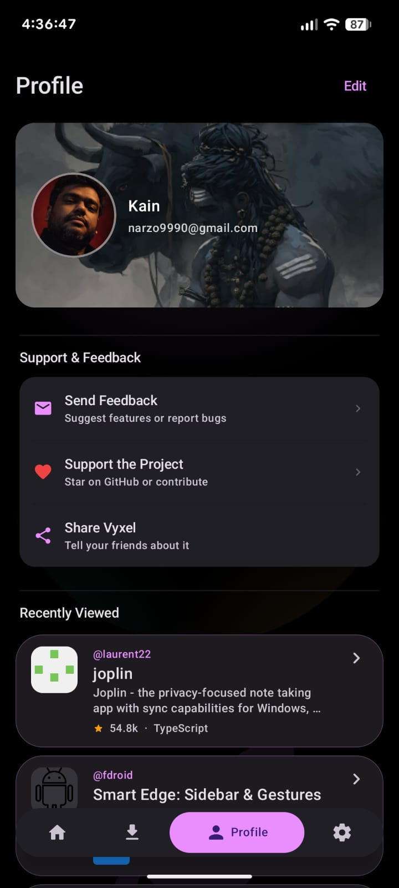
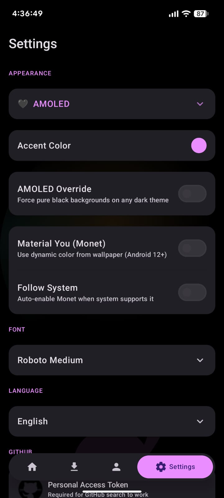
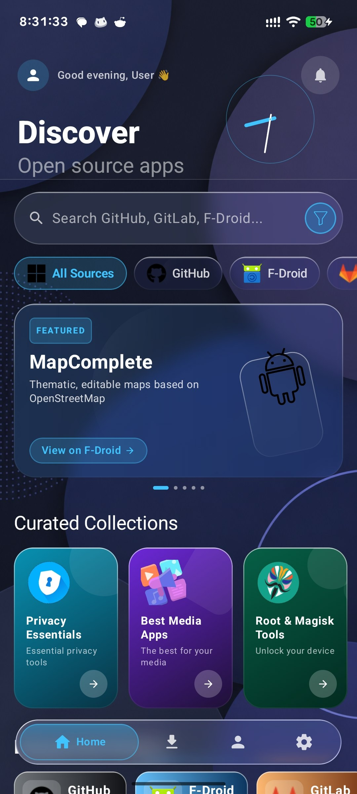
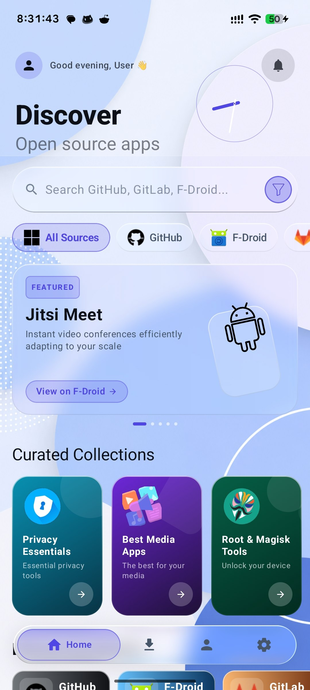
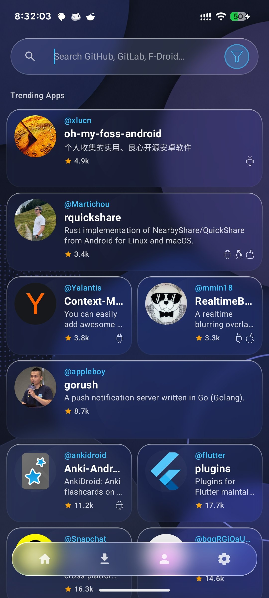
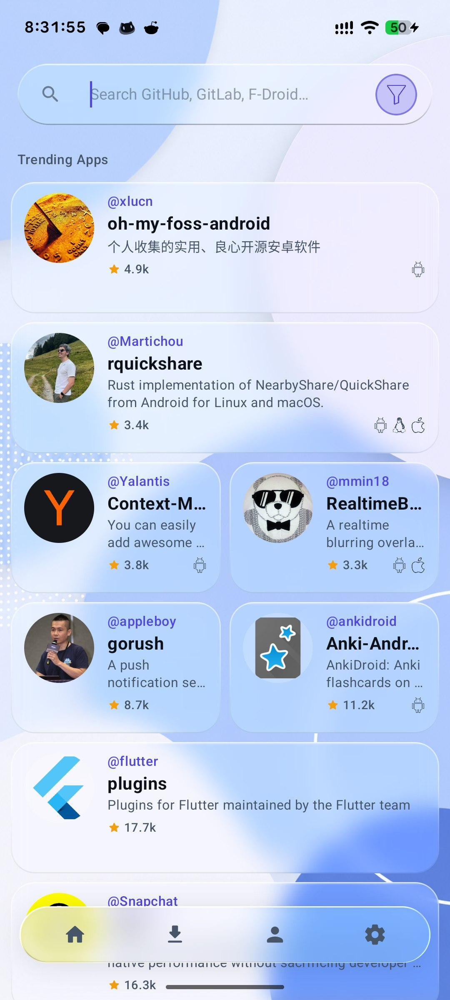
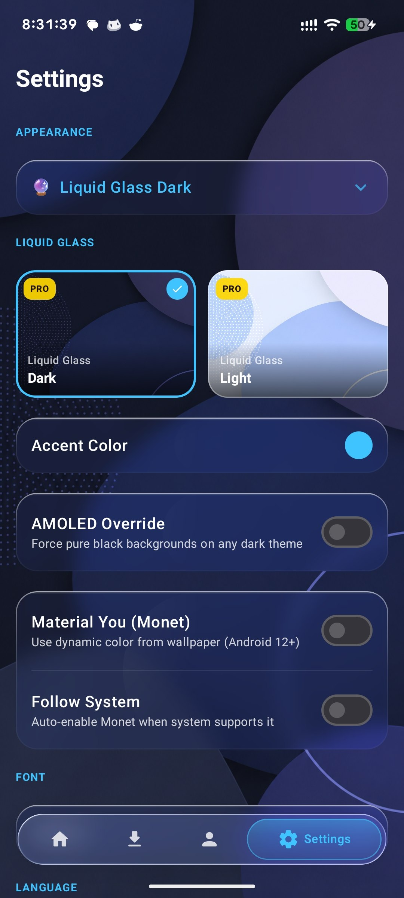

# Vyxel Apps

**The GitHub-powered Android app store.**

Discover, install, and update Android apps from GitHub releases — free, open-source, no ads, no tracking.

[**Download APK**](https://github.com/NikhilKain/vyxel-apps/releases/latest) · [**Website**](https://NikhilKain.github.io/vyxel-apps/) · [**Report Bug**](https://github.com/NikhilKain/vyxel-apps/issues)

---

> ⚠️ **Official Source Notice**
> The ONLY official source for Vyxel Apps is this repository.
> APKs from any other website, Telegram channel, or source are
> unofficial and may be tampered with. Always verify the signature.

## ✨ Features

- 🔍 **18+ curated categories** — Privacy, Media, Games, Productivity, Dev Tools, and more
- ⚡ **Smart APK detection** — auto-picks the right architecture for your device
- 🛡 **Trust Score system** — 0–100 score based on stars, activity, releases, and forks
- 🔔 **Background update monitoring** — get notified when installed apps have new releases
- ⚖️ **App comparison mode** — compare two apps side-by-side
- 📸 **Screenshots from repos** — auto-extracted from README
- 🔄 **Install history & rollback** — keeps your last 3 versions
- ⭐ **GitHub starred repos sync** — sync your stars into favourites
- 🌙 **Material 3 themes** — dark, light, AMOLED, custom accents

## 📱 Screenshots

|  |  |  |  |  |  |  |  |  |

## 📥 Installation

1. Download the latest APK from [Releases](https://github.com/NikhilKain/vyxel-apps/releases/latest)
2. On your Android device: **Settings → Apps → Special access → Install unknown apps** → enable for your browser/file manager
3. Tap the downloaded APK to install

## 🛠 Built With

- [Kotlin](https://kotlinlang.org/)
- [Jetpack Compose](https://developer.android.com/jetpack/compose)
- [Material 3](https://m3.material.io/)
- [Retrofit](https://square.github.io/retrofit/) — GitHub API client
- [Coil](https://coil-kt.github.io/coil/) — image loading
- [WorkManager](https://developer.android.com/topic/libraries/architecture/workmanager) — background update checks

## 🤝 Contributing

Contributions are welcome! Open an issue first to discuss what you'd like to change.

1. Fork the repo
2. Create a feature branch (`git checkout -b feature/cool-thing`)
3. Commit your changes (`git commit -m 'Add cool thing'`)
4. Push to the branch (`git push origin feature/cool-thing`)
5. Open a Pull Request

## 💖 Support

If Vyxel Apps is useful to you:
- ⭐ Star this repo
- 🐦 Share with your friends
- 🐛 Report bugs in [Issues](https://github.com/NikhilKain/vyxel-apps/issues)
- 📝 Send feedback via the in-app feedback button

## App Support 

 - https://t.me/vyxelapps

## 📄 License

## ☕ Support Development

Hi! I'm Nikhil, an indie Android developer building this project independently.

This app is focused on making GitHub apps easier to discover and install on Android.

If you enjoy the project and want to support future development, bug fixes, and new features, consider supporting the project ☕

### UPI Support

|  |

UPI I'd:- vyxelapps@airtel

🌍 International Support:  
https://ko-fi.com/vyxelapps

Every contribution genuinely helps and is greatly appreciated ❤️

---

Built with ❤️ for the open-source community.

